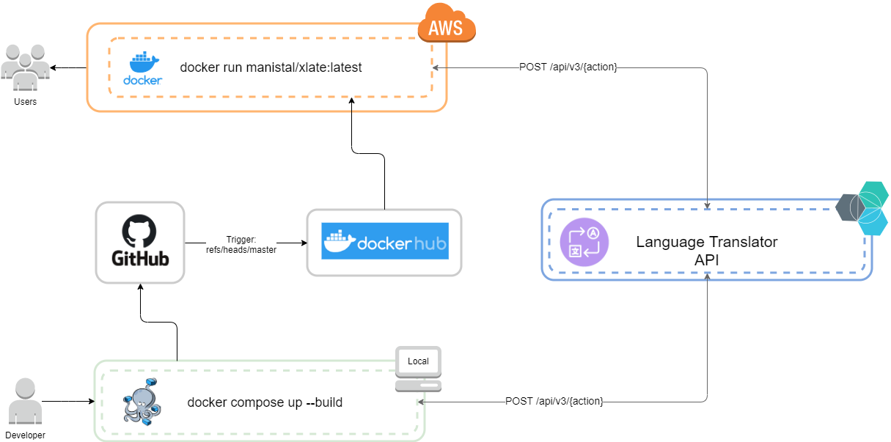

# The Language Xlator

Xlate is a language translation application that leverages Bluemix Language Translation API to translation a ton of languages! 

### Bluemix API 

You can find information about the Bluemix Language Translator here, as well as how to get an API Key and get started here:
https://cloud.ibm.com/docs/services/language-translator?topic=language-translator-gettingstarted

You can find the xlate implementation of the API here: [bluemix_translation_api.py](xlate/views/bluemix_translate_api.py)

### Web Application

The front-end is a web application based in Flask, you can find more information about Flask here:
https://www.palletsprojects.com/p/flask/

### Architecture 



## Development

To develop or contribute to Xlate, you can get started once you register for a Bluemix API key and URL (follow the instructions [here](https://cloud.ibm.com/docs/services/language-translator?topic=language-translator-gettingstarted))

There are two ways to run the application:

### Standalone Python App with Flask Debug
```
BLUEMIX_API_KEY="<KEY>" BLUEMIX_API_URL="<URL>" python3 -m xlate
```

### UWSGI with Docker-Compose 
```
BLUEMIX_API_KEY="<KEY>" BLUEMIX_API_URL="<URL>" docker-compose up --build 
```

## Deployment 

If you're looking to deploy this application to a production environment, you can deploy the latest version of the image directly from dockerhub:

```
# After logging into your provisioned Linux Server
sudo docker run -p 80:9090 -e BLUEMIX_API_KEY="<KEY>" -e BLUEMIX_API_URL="<URL>" -d manistal/xlate:latest
```
