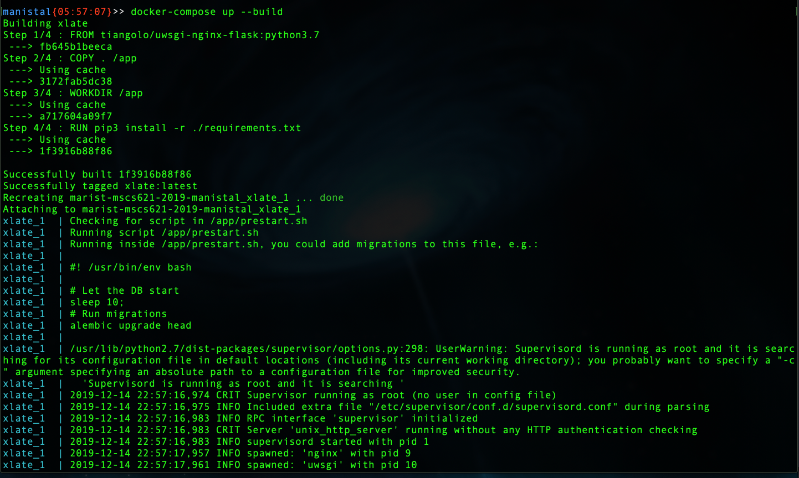
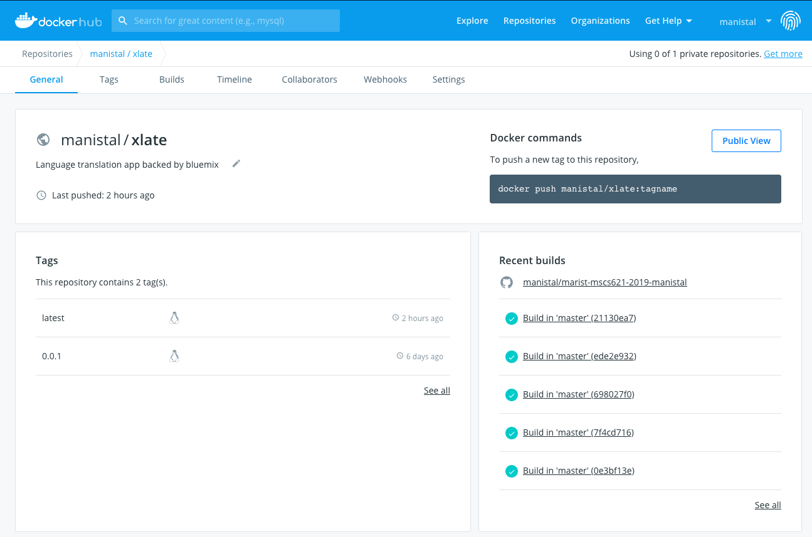

Development and Deployment Model
=================================

The development and deployment processes leverages Docker to guaruntee quality releases.

.. image:: ../MSCS621_Xlate_ArchDiagram.png

Development
^^^^^^^^^^^^^

For development, install Docker and Docker Compose. We use Docker Compose to get a full Nginx-Flask-UWSGI environment running, to ensure that traffic to the application always operates the same. 
Deployment is critical with Flask applications as you must have a WSGI server like GUnicorn or UWSGI in order to prevent yourself from exposing the debug mode directly. 
Docker Compose allows us to emulate real deployments and guaruntee the integrity of deployments on release. 

To run the release environment, simply invoke the ``build`` arg to ``up`` from the root of the project:

``docker-compose up --build``

Deployment
^^^^^^^^^^^^

Deployment is just as easy, all you need is to deploy the image itself. Just connect Dockerhub to GitHub and configure it to build image on push. 

Once Dockerhub has built the image, you can use it from any instance with:

``docker pull manistal/xlate:latest``

.. image:: ../MSCS621_Xlate_DockerRunConsole.png
